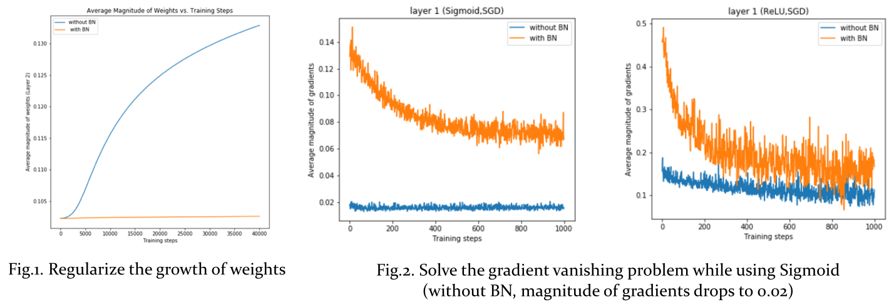
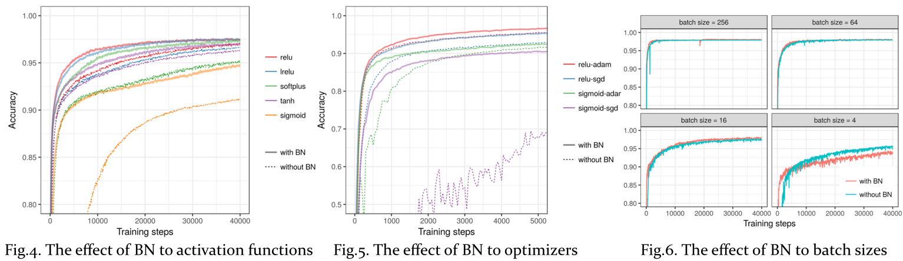

## I. Motivation 
 

Batch normalization is to accelerate network training by reducing internal covariate shift. <strong>Internal covariate shift</strong> is the change in the distribution of network activations due to the change in network parameters during training. By whitening the inputs to each layer, we would fix the input distributions and help remove the ill effects of the internal covariate shift.

But whitening each layer’s inputs is costly and not everywhere differentiable, so batch normalization made two necessary simplifications:

<blockquote>
<ol>
<li>Normalize each scalar feature <strong>independently</strong> instead of whitening</li>
<li>Use <strong>mini-batches statistics</strong> rather than global statistics in stochastic gradient training</li>
</ol>
</blockquote>

Even though batch normalization (BN) is regarded as the necessary component in many well-known network architectures, but the question that why batch normalization works so well still remains mysterious. This work aims at investigating the possible reasons or explanation in both theoretical and experimental viewpoints.

## II. Experimental Study
 

We conduct experiments on MNIST using a fully connected neural network with 3 layers.

### A. Mythbusters of Batch Normalization

Here we focus on validating the effects of batch normalization, and the author made the following claims in the original paper:

<blockquote>

Claim 1: BN regularizes the model

</blockquote>

 Fig.1. implies that BN does limit the growth of magnitude of weights over training steps.

<blockquote>

Claim 2: BN solves the gradient vanishing problem

</blockquote>

 Fig.2. shows that the average magnitude of gradients in the first hidden layer is about 0.1 with BN, but it drops to 0.02 if without BN.

<blockquote>

Claim 3: BN benefits gradient flows through network

</blockquote>

We restore the distribution of singular values of layer's Jacobian in every training steps. According to the following GIF(s), we found that BN helps shift the distribution of <strong>singular values of layer's Jacobian</strong> closer to one, and this keeps good <strong>isometry</strong> when error propagates through the network.

### B. Which factors is the most influential to BN?

<blockquote>

Activation functions: relu, lrelu, sigmoid, softplus, tanh

</blockquote>

 In Fig.4., BN benefits the performance no matter which activation functions are used, and BN affects the case of Sigmoid most.

<blockquote>

Optimizers: SGD, Adam

</blockquote>

Fig.5. shows that the selection of optimizers is less important than that of activation functions. (ReLU-SGD, with BN) is competitive to (ReLU-Adam, without BN), which reveals that BN is as effective as the sophisticated optimization algorithm like Adam.

<blockquote>

Batch size: 4, 16, 64, 256

</blockquote>

Fig.5. depicts that BN deteriorates performance when batch size is small because the statistics of a small batch are not representive enough.

<h2 style=""> III. Conclusions <h2>
 
<ol>
<li> We have experimentally showed the facts
<ul> 
<li>BN improves performance no matter which activation functions or optimizers are selected; </li>
<li>with BN, activation function is more crucial than optimizer</li>
</ul>
</li>
 
<li> We have verified the following claims
<ul>
<li> regularize the weights to reduce overfitting</li>
<li> solve the issue of gradient vanishing significantly</li>
<li> benefit gradient flow through network to accelerate training process</li>
</ul>
</li>
 
<li> By analyzing the distribution of singular values of layer's Jacobian, we show that BN is beneficial to keep better isometry while error backpropagtes through the network
</li> 
<li> We investigate the conditions that BN worsens performance:
<ul>
<li> too small batch size </li>
<li> mismatched distribution between training and testing datasets</li>
</ul>
But fortunately, the above issues can be solved by Batch Re-Nomalization (BRN)
</li>
</ol>

- Github repository >> [https://github.com/twcmchang/MLDS_final_2017](https://github.com/twcmchang/MLDS_final_2017)

## References
<ol style="font-size: 0.5rem">
<li>Ioffe, Sergey, Szegedy, Christian. Batch normalization: Accelerating deep network training by reducing internal covariate shift. arXiv preprint arXiv:1502.03167, 2015.</li>

<li>Saxe, Andrew M., McClelland, James L., and Ganguli, Surya. Exact solutions to the nonlinear dynamics of learning in deep linear neural networks. CoRR, abs/1312.6120, 2013.</li>

<li>Nair and Hinton, 2010 Nair, Vinod and Hinton, Geoffrey E. Rectified linear units improve restricted boltzmann machines. In ICML, pp. 807–814. Omnipress, 2010.</li>

<li>Shimodaira, Hidetoshi. Improving predictive inference under covariate shift by weighting the log-likelihood function. Journal of Statistical Planning and Inference, 90(2):227–244, October 2000.</li>

<li>LeCun, Y., Bottou, L., Orr, G., and Muller, K. Efficient backprop. In Orr, G. and K., Muller (eds.), Neural Networks: Tricks of the trade. Springer, 1998b.</li>

<li>Wiesler, Simon and Ney, Hermann. A convergence analysis of log-linear training. In Shawe-Taylor, J., Zemel, R.S., Bartlett, P., Pereira, F.C.N., and Weinberger, K.Q. (eds.), Advances in Neural Information Processing Systems 24, pp. 657–665, Granada, Spain, December 2011.</li>

<li>Wiesler, Simon, Richard, Alexander, Schlu ̈ter, Ralf, and Ney, Hermann. Mean-normalized stochastic gradient for large-scale deep learning. In IEEE International Conference on Acoustics, Speech, and Signal Processing, pp. 180–184, Florence, Italy, May 2014.

<li>Raiko, Tapani, Valpola, Harri, and LeCun, Yann. Deep learning made easier by linear transformations in perceptrons. In International Conference on Artificial Intelligence and Statistics (AISTATS), pp. 924–932, 2012.</li>

<li>Povey, Daniel, Zhang, Xiaohui, and Khudanpur, San- jeev. Parallel training of deep neural networks with natural gradient and parameter averaging. CoRR, abs/1410.7455, 2014.</li>

<li>Wang, S., Mohamed, A. R., Caruana, R., Bilmes, J., Plilipose, M., Richardson, M., Aslan, O. (2016, June). Analysis of Deep Neural Networks with the Extended Data Jacobian Matrix. In Proceedings of The 33rd International Conference on Machine Learning (pp. 718-726).</li>

<li>JIA, Kui. Improving training of deep neural networks via Singular Value Bounding. arXiv preprint arXiv:1611.06013, 2016.</li>

<li>R2RT Implementing Batch Normalization in Tensorflow: https://r2rt.com/implementing-batch-normalization-in-tensorflow.html</li>
</ol>

## Presentation Slides
 
<iframe src="//www.slideshare.net/slideshow/embed_code/key/GDTNdQPxwOQ02I" width="595" height="485" frameborder="0" marginwidth="0" marginheight="0" scrolling="no" style="border:1px solid #CCC; border-width:1px; margin-bottom:5px; max-width: 100%;" allowfullscreen> </iframe> 
 <strong> <a href="//www.slideshare.net/ssuser950871/why-batch-normalization-works-so-well" title="Why Batch Normalization Works so Well" target="_blank">Why Batch Normalization Works so Well</a> </strong> from <strong><a href="https://www.slideshare.net/ssuser950871" target="_blank">Chun-Ming Chang</a></strong> 

<!-- ## Motivation: Why Needs Batch Normalization?
Batch normalization is to accelerate network training by reducing internal covariate shift. **Internal covariate shift** is the change in the distribution of network activations due to the change in network parameters during training. By whitening the inputs to each layer, we would take a step towards achieving the fixed distributions of inputs that would remove the ill effects of the internal covariate shift.

The full whitening of each layer’s inputs is costly and not everywhere differentiable, so, in batch normalization, there are two necessary simplifications:
1. instead of whitening the features in layer inputs and outputs jointly, **independently normalize** each scalar feature
2. use **mini-batches statistics** rather than global statistics in stochastic gradient training

## Experimental Study

We conduct experiments on MNIST using a fully connected neural network with 3 layers to validate the claims made by the authors of the original BN paper, and the authors point out that

### BN regularizes the model
Fig.1. implies that BN does limit the growth of magnitude of weights over training steps. 

### BN solves the gradient vanishing problem
Fig.2. shows that in use of **Sigmoid, with BN**, the average magnitude of gradients of the first hidden layer holds up to 0.1 (the case of **Sigmoid, without BN** is 0.02). 

### BN benefits gradient flows through network
We restore the distribution of singular values of layer's Jacobian in every training steps. According to the following GIF(s), we found that BN helps shift the distribution of **singular values of layer's Jacobian** closer to one, and this keeps good **isometry** when error propagates through the network.

## Which the following factors affect the effect of BN most?

| Experiment | Alternatives |
|------------|--------------|
| 1. Activation function |  lrelu, relu (default), sigmoid, softplus, tanh |
| 2. Optimizer  | Adam (default), SGD |
| 3. Batch size | 4, 16, 64 (default), 256 |

- **Exp1**: BN benefits the performance no matter which activation functions are used, and BN affects the case of Sigmoid most.
- **Exp2**: with BN, the selection of activation functions is more crucial than that of optimizer. Besides, (ReLU-SGD, with BN) is similar with (ReLU-Adam, without BN) and this reveals that BN is as effective as the sophisticated optimization algorithm like Adam.
- **Exp3**: BN deteriorates performance when batch size is small because the statistics of a small batch are not representive enough.

## Conclusions
- We have showed 
	(1) BN speeds up training process and improves performance no matter which activation functions or optimizers are used
	(2) With BN, activation function is more crucial than optimizer
- We have verified the following claims
	(1) solve the issue of gradient vanishing,
	(2) regularize the weights, and
	(3) benefit gradient flow through network
- According to analyzing the distribution of singular values of layer's Jacobian, we show that BN does benefit keeping better isometry while error backpropagtes through the network
- We investigate the conditions that BN worsens performance
	(1) too small batch size or
	(2) greatly mismatched training/testing data distribution.
	But fortunately, the above issues can be solved by Batch Re-Nomalization (BRN)

## Reference
**[S. Ioffe & C. Szegedy, 2015]** Ioffe, Sergey, Szegedy, Christian. Batch normalization: Accelerating deep network training by reducing internal covariate shift. arXiv preprint arXiv:1502.03167, 2015.

**[Saxe et al., 2013]** Saxe, Andrew M., McClelland, James L., and Ganguli, Surya. Exact solutions to the nonlinear dynamics of learning in deep linear neural networks. CoRR, abs/1312.6120, 2013.

**[Nair & Hinton, 2010]** Nair, Vinod and Hinton, Geoffrey E. Rectified linear units improve restricted boltzmann machines. In ICML, pp. 807–814. Omnipress, 2010.

**[Shimodaira, 2000]** Shimodaira, Hidetoshi. Improving predictive inference under covariate shift by weighting the log-likelihood function. Journal of Statistical Planning and Inference, 90(2):227–244, October 2000.

**[LeCun et al., 1998b]** LeCun, Y., Bottou, L., Orr, G., and Muller, K. Efficient backprop. In Orr, G. and K., Muller (eds.), Neural Networks: Tricks of the trade. Springer, 1998b.

**[Wiesler & Ney, 2011]** Wiesler, Simon and Ney, Hermann. A convergence analysis of log-linear training. In Shawe-Taylor, J., Zemel, R.S., Bartlett, P., Pereira, F.C.N., and Weinberger, K.Q. (eds.), Advances in Neural Information Processing Systems 24, pp. 657–665, Granada, Spain, December 2011.

**[Wiesler et al., 2014]** Wiesler, Simon, Richard, Alexander, Schlu ̈ter, Ralf, and Ney, Hermann. Mean-normalized stochastic gradient for large-scale deep learning. In IEEE International Conference on Acoustics, Speech, and Signal Processing, pp. 180–184, Florence, Italy, May 2014.

**[Raiko et al., 2012]** Raiko, Tapani, Valpola, Harri, and LeCun, Yann. Deep learning made easier by linear transformations in perceptrons. In International Conference on Artificial In- telligence and Statistics (AISTATS), pp. 924–932, 2012.

**[Povey et al., 2014]** Povey, Daniel, Zhang, Xiaohui, and Khudanpur, San- jeev. Parallel training of deep neural networks with natural gradient and parameter averaging. CoRR, abs/1410.7455, 2014.

**[Wang et al., 2016]** Wang, S., Mohamed, A. R., Caruana, R., Bilmes, J., Plilipose, M., Richardson, M., ... & Aslan, O. (2016, June). Analysis of Deep Neural Networks with the Extended Data Jacobian Matrix. In Proceedings of The 33rd International Conference on Machine Learning (pp. 718-726).

**[K. Jia, 2016]** JIA, Kui. Improving training of deep neural networks via Singular Value Bounding. arXiv preprint arXiv:1611.06013, 2016.

**[R2RT]** Implementing Batch Normalization in Tensorflow: https://r2rt.com/implementing-batch-normalization-in-tensorflow.html
 -->
