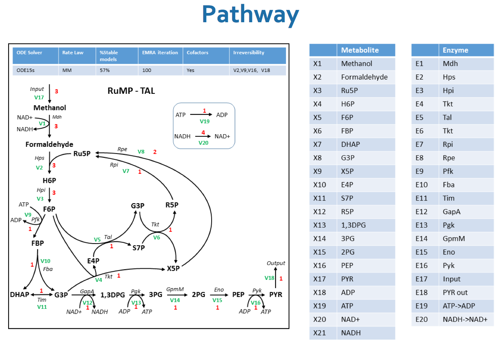
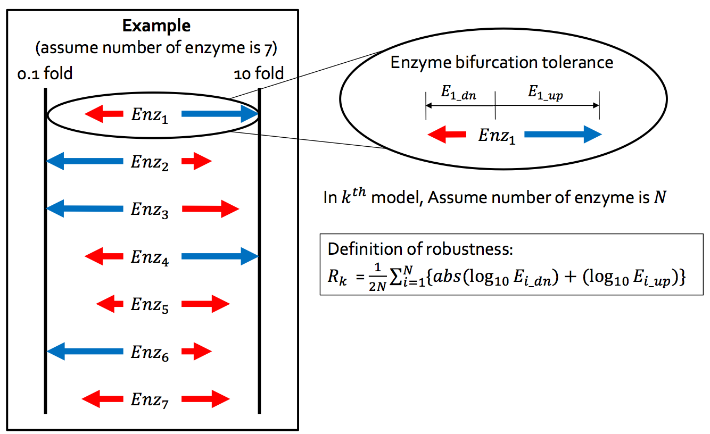
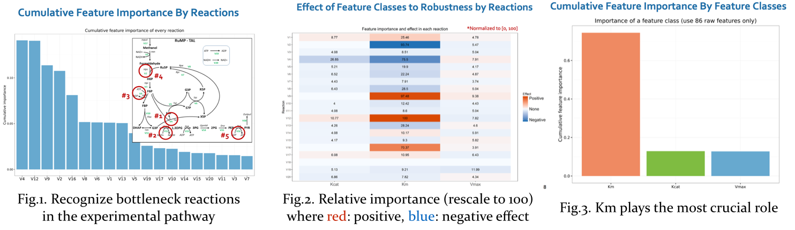
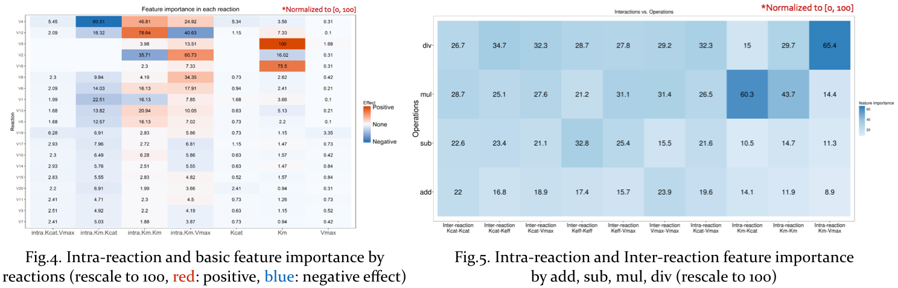
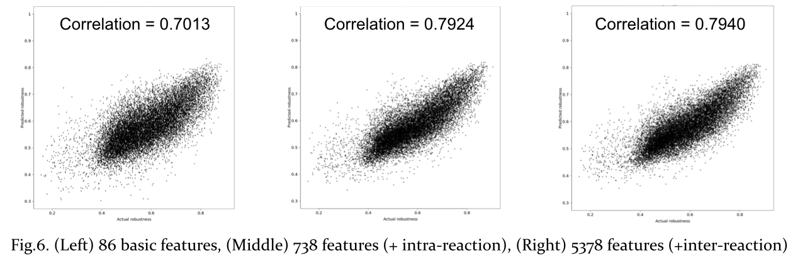

This work analyzes the influence of enzyme kinects to the robustness of a metabolic system, also called pathway, and provides insights on how to adjust system parameters. Several machine learning techniques are applied to **recognize bottleneck reactions** and **identify reactions to be either positive or negative** to system robustness by the correlation test.
- This work is collaborated with [Metabolic Engineering and Synthetic Biology Laboratory](http://www.seas.ucla.edu/liao_lab/team.html]) lead by Prof. James C. Liao, UCLA
- This work can be regarded as a pilot project that analyzes metabolic pathways in view of machine learning researchers
- The target pathway is related to CO2 fixation and produciton of fuels and chemicals, but the results are not for public distribution currently

## Application of Our Analysis
Our analysis can provide insightful suggestions on (1) which one parameter should be adjusted first and (2) which direction (up or down) of the parameter should change, thus searching for a robust system parameter is much more effective and efficient. Several scenarios are as follows:
### Scenario 1: given a parameter vector, only Vmax(s) of all reactions are tunable
for example, a parameter vector which yields robustness = 0.19 can be optimized to yield robustness = 0.53 by only changing Vmax.
### Scenario 2: given a parameter vector, only parameters of any single one reaction are tuneable
for example, a parameter vecotr which yields robustness = 0.19 can be optimized to yield robustness = 0.49 by only changing Km, Kcat and Vmax of v4 since the 4th reaction is the most crucial.
### Scenario 3: given a parameter vector, only one parameter is tuneable
for example, a parameter vecotr which yields robustness = 0.19 can be optimized to yield robustness = 0.32 by only lowering Km of v4, because v4 is the most crucial reaction where its Km is the most important and has negative effect to robustness.

## Dataset and Definition of Robustness
### Dataset
- Our dataset is simuldated by [Metabolic Engineering and Synthetic Biology Laboratory](http://www.seas.ucla.edu/liao_lab/team.html) lead by Prof. James C. Liao, UCLA (currently the President of Academia Sinica since 2017).
- There are 86 tunable parameters in this pathway and total 116,911 simulated models.

### Definition of Robustness
A "robust" metabolic pathways: if a setting of system parameters can meet the [Michaelis–Menten kinetics](https://en.wikipedia.org/wiki/Michaelis%E2%80%93Menten_kinetics) and reach steady-state concentrations of all substrates, the parameter setting is one of the feasible solutions of this pathway.

We quantify the **enzyme-wise robustness as the tolerance for individual enzyme perturbations**. For one enzyme, we estimate three terms below.
- Enz_up   = Enzyme tolerance when going up (overexpression)
- Enz_down = Enzyme tolerance when going down (knockdown)
- Enzyme-wise robustness = 0.5\*abs(log10(Enz_up)) + 0.5\*abs(log10(Enz_down))
- **System-wise robustness** = summation of each enzyme-wise robustness
- Note that **(1)** Enz_up and Enz_down are estimated by simulation and **(2)** The enzyme perturbation is done by overexpression from 1 to 10 folds and knockdown from 1 to 0.1 fold

## Methodology
- Here we apply random forests (RF) method, a boostrap aggregating on decision tree.
- RF can calculate feature importances by summing up information gains from every split, and can capture non-linear relationships between input and output variables.
- Correlation test is used to identify that a parameter has positive or negative effect to system robustness. 
	- if correlation coefficient greater than 0 significantly, then positive
	- if correlation coefficient smaller than 0 significantly, then negative
	- otherwise, no significant effect

## Result on Basic 86 Features
- Fig.1. depicts that several reactions are recognized as bottleneck in the experimental pathway and there are some common characteristics of these bottleneck reactions:
	1. usually accompany with other side reactions like the conversion of ATP to ADP or reduction of NAD+ to NADH, e.g. v12(rank 2), v9(rank 3), v16(rank 5).
	2. usually belong to multiple-substrate mechanisms, e.g. v4(rank 1), v2(rank 4).
- Fig.2. shows the importance by each feature class in every reaction. It's worth to mention that reactions with other side reactions usually have negative effect to robustness, but most multiple-substrate reactions have positive effect to robustness.
- Fig.3. visualizes in view of feature classes. Km is the most important class and this finding is counterintuitive to the metabolic system researchers. But in our further study, adjusting Km seems the most cost-effective to robustness.

## Interactions among reactions
We formulate the interactions among reactions in operations of addition, substraction, multiplicaiton, and division. All kinds of interactions are categorized into two types: intra-reaction and inter-reaction.

- **Intra-reaction**: create features by parameters in same reaction. For example, v4's Km multiplies v4's Vmax.
- **Inter-reaction**: create features by parameters among different reactions. For example, v4's Km divides v5's Km.

Here we identified reactions to be either positive or negative to system robustness by the correlation test, and we made some observations from Fig.4.
- Intra-reactions of Km-Km and Km-Vmax are more important than Km-Kcat and Kcat-Vmax. This copies with the understanding of enzyme kinetics.
- Among basic features, only Km(s) of v9, v2, and v16 have importance greatrer than 10, and thus adding intra-reactions into predictive models have better performance.

In addition, we would like to compare among different operations of +,-,\*,/ and aggregate their importance. There are several interesting findings from Fig.5.
- Intra-reactions of Km-Vmax using division are the most important among all interactions. The most exciting is that this term in fact apperas in the Michaelis–Menten equation. 
- Mulitiplication and division occupies 70% importance in 3 out of 4 intra-interactions.

Even though we are not experts in metabolic systems, based on our analysis, we can still extract hidden relations among parameters and figure out which factors influence metabolic systems most.

## Prediction Performance
We compare 3 models with different sets of features:
1. use 86 basic features
2. add 652 intra-reaction interactions into the model of 1
3. add 4,640 inter-reaction interactions into the model of 2

Note that we also apply deep neural networks for more accurate predictive modeling and achieve correlation coefficient up to 0.88. Our goal, however, is to interpret the results from machine learning model but DNN is less suitable to further analyze the relations between input features and output responses.

## Conclusions
- This work analyzes the influence of enzyme kinects to the robustness of metabolic pathways by machine learning techniques. We can recognize bottleneck reactions and identify reactions to be either positive or negative to system robustness by the correlation test. Also, our results provide insights on how to effectively and efficiently adjust system parameters to make the metabolic system robust.
- This work can be regarded as a pilot project that analyzes metabolic pathways in view of machine learning researchers.
- This work is collaborated with [Metabolic Engineering and Synthetic Biology Laboratory](http://www.seas.ucla.edu/liao_lab/team.html]) lead by Prof. James C. Liao, UCLA.
- The target pathway is related to CO2 fixation and produciton of fuels and chemicals, but the results are not for public distribution currently.

## Appendix: Enzyme in Metabolic Pathways
In a metabolic pathway, one enzyme catalyzes a chemical reaction and turns substrates, which is usually the products of another enzyme, into products. Metabolic pathways are typically complex and various interactions among reactions lead to the difficulty of efficiently find a configuration of parameters to make pathways robust. 

Enzyme rates depend on solution conditions and **substrate concentrations**. For a given enzyme concentration and for relatively low substrate concentrations, the reaction rate increases linearly with substrate concentration; the enzyme molecules are largely free to catalyse the reaction, and increasing substrate concentration means an increasing rate at which the enzyme and substrate molecules encounter one another.

However, at relatively high substrate concentrations, the reaction rate asymptotically approaches the **theoretical maximum**; the enzyme active sites are almost all occupied and the reaction rate is determined by the **intrinsic turnover rate** of the enzyme. 
- The substrate concentration midway between these two limiting cases is denoted by **Km**.
- The theoretical maximum reaction rate is denoted by **Vmax**.
- The intrinsic turnover rate is denoted by **Kcat**.

## Presentation Slides
<iframe src="//www.slideshare.net/slideshow/embed_code/key/qqzysWM3i1q9HE" width="595" height="485" frameborder="0" marginwidth="0" marginheight="0" scrolling="no" style="border:1px solid #CCC; border-width:1px; margin-bottom:5px; max-width: 100%;" allowfullscreen> </iframe> 
 <strong> <a href="//www.slideshare.net/ssuser950871/using-machine-learning-in-metabolic-system-analysis-explanation-and-prediction" title="Using Machine Learning in Metabolic System Analysis: Explanation and Prediction" target="_blank">Using Machine Learning in Metabolic System Analysis: Explanation and Prediction</a> </strong> from <strong><a href="https://www.slideshare.net/ssuser950871" target="_blank">Chun-Ming Chang</a></strong> 

